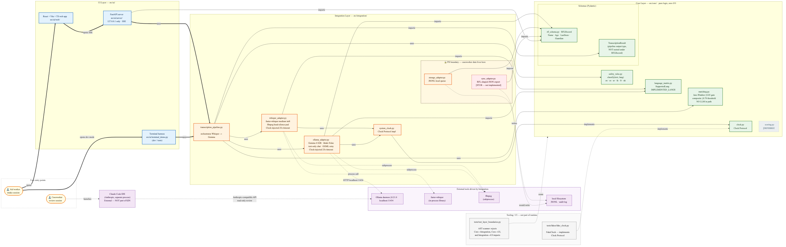
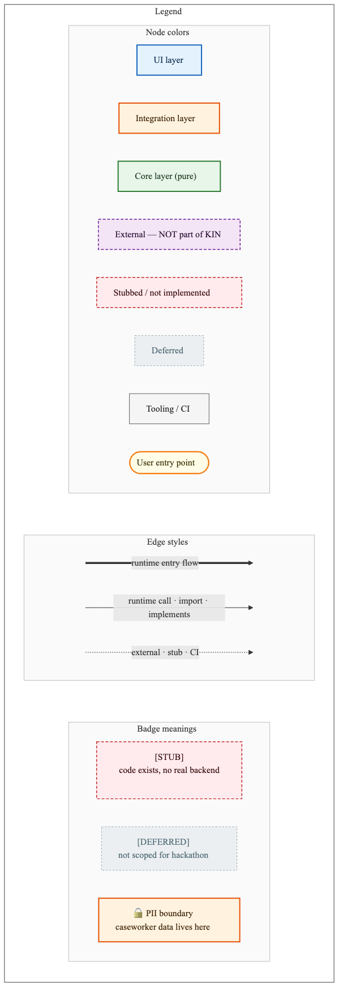

# KIN

> Offline multilingual family-reunification intake copilot.
> Built for the Gemma 4 Good Hackathon (Kaggle), May 2026.

KIN turns a displaced person's voice note into a structured
humanitarian record — running entirely on a single laptop via Ollama,
in 6 languages (English, Spanish, Arabic, Persian/Farsi, French,
Ukrainian), without a single byte of user data leaving the device.

## Architecture

Source: [docs/architecture-diagram.mmd](docs/architecture-diagram.mmd) · [docs/architecture-diagram-legend.mmd](docs/architecture-diagram-legend.mmd)

### Legend

| Visual | Meaning |
|---|---|
| 🟦 Blue node | UI layer — `src/ui/` |
| 🟧 Orange node | Integration layer — `src/integration/` |
| 🟩 Green node | Core layer — `src/core/`, pure logic, zero I/O |
| 🟪 Purple dashed node | External tool — NOT part of KIN |
| 🟥 Red dashed node | Stubbed / not implemented |
| ⚪ Grey dashed node | Deferred (not scoped for hackathon) |
| ⬜ Light grey node | Tooling / CI — not part of runtime |
| 🟨 Yellow oval | User entry point |
| ━━ Thick arrow | Runtime entry flow |
| ─→ Solid arrow | Runtime call (`uses`) or import (`imports`) or interface (`implements`) |
| ╌→ Dashed arrow | External call, stub, or CI-only relationship |
| 🔒 Dashed PII box | PII boundary — caseworker data lives here |
| `[STUB]` | Code exists, no real backend wired up |
| `[DEFERRED]` | Not scoped for the hackathon submission |

### Layers and discipline

KIN follows a strict three-layer hexagonal architecture, enforced by
an AST scanner ([tests/test_layer_boundaries.py](tests/test_layer_boundaries.py)):

- **Core** (`src/core/`) — pure logic. Zero I/O, zero network, zero
  model calls. Pydantic schemas, safety rules, matching logic,
  language registry, Clock Protocol. Fully testable without any
  external dependency.
- **Integration** (`src/integration/`) — adapters only. Wraps Whisper
  (ASR) and Ollama (Gemma 4 E2B text reasoning) behind Clock-injected
  25-second timeouts. Owns ffmpeg head-silence padding, structured
  logging, and GGML retry. Makes zero business decisions.
- **UI** (`src/ui/`) — FastAPI server (`127.0.0.1` only) + React web
  app + terminal harness. Orchestration only; no business logic.

The "caseworker review" beat in the demo uses Anthropic's external
**Claude Code IDE** pointed at the local Ollama daemon's
Anthropic-compatible API. That is a separate process the operator
launches — KIN's own UI never opens a connection to Ollama.

## Hackathon framing

- **Primary prize target:** Digital Equity & Inclusivity ($10k)
- **Demo languages:** English, Spanish, Arabic, Persian/Farsi (full
  end-to-end coverage)
- **Validated-and-claimed languages:** French, Ukrainian (Whisper
  FLEURS baseline + crisis-keyword classification)
- **Model:** Gemma 4 E2B (smallest variant, fits 8–16 GiB
  field-deployed laptops)
- **Hardware target:** MacBook Air M4, 16 GiB unified memory
